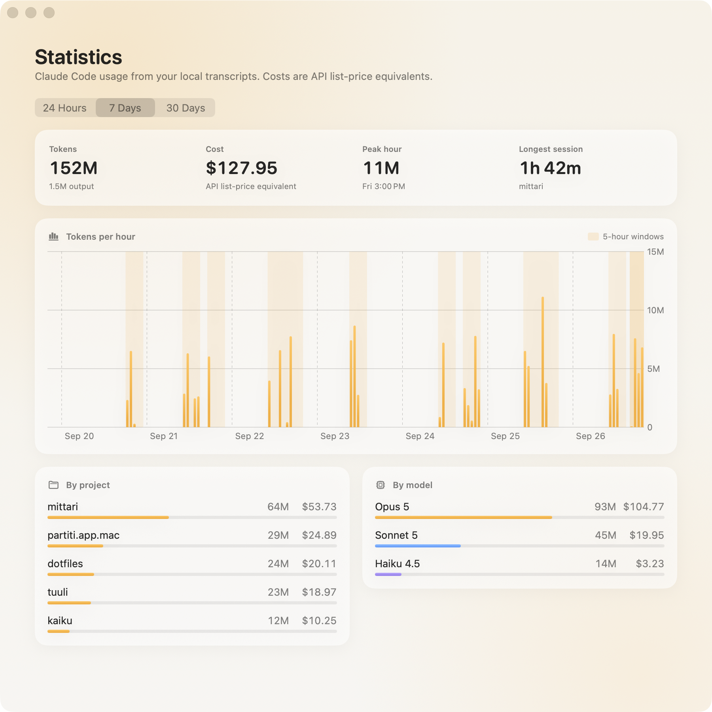
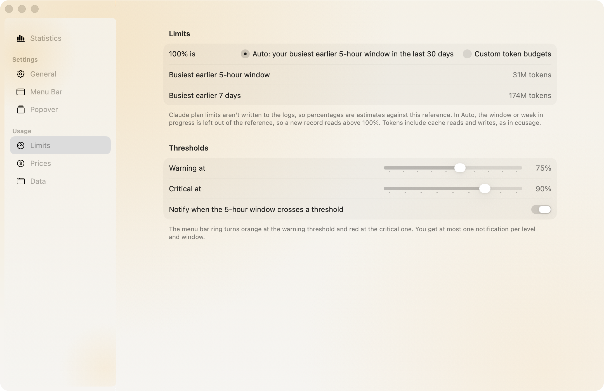
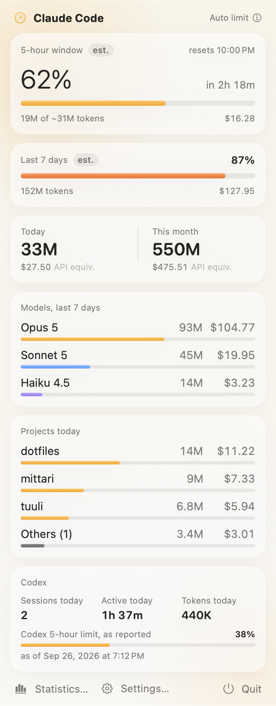

<div align="center">


# Mittari

**Claude Code and Codex usage in the menu bar. Free and open source.**

[](#install)
[](Package.swift)
[](https://www.gnu.org/licenses/gpl-3.0.html)

<picture>
  <source media="(prefers-color-scheme: dark)" srcset="docs/screenshots/statistics-dark.png">
  
</picture>

</div>

## Features

- **5-hour window**: how far into the current window you are, when it resets and what it would have cost on the API.
- **Menu bar**: pick and order a ring gauge, the window percentage, time to reset, tokens today and cost today. The ring turns orange and red past your thresholds.
- **Popover**: week, today and this month, models, projects and Codex, each section can be hidden or reordered.
- **Statistics**: tokens per hour or day over 24 hours, 7 days or 30 days, with 5-hour windows shaded, plus breakdowns by project and model.
- **Notifications** when the window crosses the warning or critical threshold.
- **Codex**: sessions and active time today, and tokens and plan limits when your Codex version logs them.

<p align="center">
  <picture>
    <source media="(prefers-color-scheme: dark)" srcset="docs/screenshots/limits-dark.png">
    
  </picture>
  &nbsp;
  <picture>
    <source media="(prefers-color-scheme: dark)" srcset="docs/screenshots/popover-dark.png">
    
  </picture>
</p>

## Requirements

- A Mac with macOS 26 or later.
- Claude Code, Codex CLI, or both, used on this Mac.

## Install

1. Download the latest `Mittari-<version>.dmg` from [Releases](https://github.com/gabry-ts/mittari/releases) and drag the app to Applications.
2. Mittari is signed with a local Apple Development identity and not notarized, so Gatekeeper blocks the first launch:
   - Open the app once, then go to **System Settings > Privacy & Security** and click **Open Anyway**.
   - Or remove the quarantine flag from Terminal: `xattr -dr com.apple.quarantine /Applications/Mittari.app`
3. Launch Mittari. The gauge appears in the menu bar; the first read of your logs takes a few seconds.

## How the numbers work

- **Where they come from**: Claude Code transcripts in `~/.claude/projects` (and `~/.config/claude/projects` or `$CLAUDE_CONFIG_DIR`), and Codex sessions in `~/.codex/sessions`. The last 40 days are read, then only lines appended since.
- **Tokens** include input, output, cache writes and cache reads, as in ccusage. A response logged more than once (streaming, resumed sessions) counts once.
- **5-hour windows** start at the first message, rounded down to the hour, and last five hours; the next message after that opens a new one.
- **Percentages are estimates.** Plan limits aren't in the logs, so 100% is either your busiest earlier 5-hour window (and week) in the last 30 days, or token budgets you set in **Limits**. The week is the rolling last 7 days.
- **Costs are an API list-price equivalent**, not what a Claude subscription charges. Each message is priced with the prices valid on its date, so past costs stay put when prices change. The defaults come from Anthropic's pricing page as of 26 September 2026; Mittari never checks online, so add new prices in **Prices** when they change. Models without a price show no cost rather than a guess.
- **Codex** sessions and active time come from the first and last event of each session. Tokens and limits only appear if your Codex version writes `token_count` events.

## Build from source

Requires Xcode (or the Command Line Tools) with Swift 6.2.

```sh
./scripts/build.sh      # build/Mittari.app
open build/Mittari.app
./scripts/make-dmg.sh   # build/Mittari-<version>.dmg
swift test              # core tests
```

Set `MITTARI_SIGN_IDENTITY` to sign with your own identity. `Mittari --render-snapshots <dir>` renders every screen with sample data, `Mittari --render-icon <dir>` the app icon, and `Mittari --summary` prints what it reads from your logs.

## Uninstall

Quit Mittari and remove it from `/Applications`. Delete `~/Library/Application Support/Mittari` to also clear its settings.

## Privacy

- Mittari only reads your Claude Code and Codex logs. It never writes to them.
- No network access, no analytics, no account, no server. Settings stay on your Mac.

## License

Copyright (C) 2026 Gabriele Partiti

Mittari is free software, released under the [GNU General Public License v3.0](https://www.gnu.org/licenses/gpl-3.0.html).
